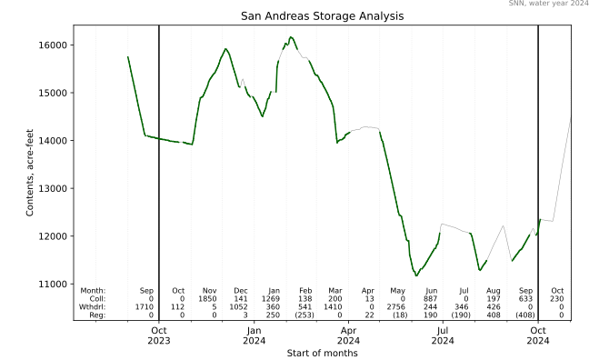

# Mork 30
An implementation of the 30-day storage rule, for California State Water Resources Control Board water right utilization reporting.

## How do I use this?
This program contains an algorithm and examples demonstrating its use.
The examples pull data from the California DWR CDEC system.
Remember, all data on CDEC is provisional; do
not use CDEC as your source for preparing annual reports!
You should adapt this program to read time series observations from your own
water management database. Example usage:

```
python one_res_one_wy_cdec.py ORO 2021
```
pulls data reported to CDEC for Lake Oroville, water year 2020-2021, then computes the 30-day-rule storage.


```
python one_res_one_wy_cdec.py SNN 2024
```
pulls data reported to CDEC for San Andreas Lake, water year 2023-2024.



For other examples, please see `examples.sh` and please understand these are merely illustrative
reservoirs which illustrate the featurs of Mork30, using unverified data from a public server.

[List of stations on CDEC](https://cdec.water.ca.gov/dynamicapp/staSearch?sta=&sensor_chk=on&sensor=15&collect=NONE+SPECIFIED&dur_chk=on&dur=D&active=&lon1=&lon2=&lat1=&lat2=&elev1=-5&elev2=99000&nearby=&basin=NONE+SPECIFIED&hydro=NONE+SPECIFIED&county=NONE+SPECIFIED&agency_num=0&display=sta)

The script can be configured to write a monthly summary of water volumes collected and withdrawn, as well as
water volumes held over in regulatory storage. (Those terms are explained ahead). The script can also
output a JSON formatted text file with the daily values.

## Some background
### What is diversion?
When it comes to reporting water use, there are two kinds of diversion, _direct diversion_ and _diversion to storage_.
If you take natural water and use it right away, generally speaking that is direct diversion.
Many water rights also allow storage, in a reservoir. Reservoirs are often large steel
tanks, but most are formed by dams.
Adding water to storage is called _collection_.

(By _natural_ water we mean water in the environment, from a stream or rainfall.
Water which you or another person did not already take from the environment.)

If you store water, usually you'll need to track how much, in acre-feet, and when.
You'll need to report the volume of diversion to storage, as well as when you withdraw it
from storage later to put it to an authorized beneficial use.
You cannot store directly-diverted water, because by definition, directly diverted water
must be placed to a beneficial use right away.
Instead, you've _diverted to storage_ that natural water.

Some collection to storage might be rediversion of _controlled water_.
So, not all collection is diversion to storage.
(We threw in another term there, _controlled_ water: that's water which you previously diverted
and then sent downhill, probably to be _rediverted_ and then used elsewhere.)

### Refill
Most water purveyors divert water to storage during the rainy season and then
withdraw water for use in the late spring through autumn.
The regulations have a special provision, though. It applies if you withdraw
water during the wetter season and then collect additional water, known as refill.
If you have a large system, some of that water might be withdrawal of controlled water from another authorized
storage reservoir uphill.

You don't need to refill your reservoir completely for this to be labeled "refill."

This special provision applies to this refill water, whether it's new diversion to storage or
re-diversion to storage.
If your reservoir gains refill contents and you subsequently release that water a few days later,
it doesn't count as collection.

The regulations define "a few days later" as 30 days. Water brought into your reservoir and then
released within 30 days is called _regulation of water_, not collection. If it's new water from nature, that counts as direct diversion. Otherwise, if that is controlled water diverted somewhere upstream it's re-diversion.

Here is an excerpt from Title 23, California Code of Regulations, Section 657.  This involves storage or regulatatory determination for water reservoirs filled in whole or in part more than once during a single water year.

> Regulation of water means the direct diversion of water to a tank or 
> reservoir in order that the water may be held for use at a rate other than the 
> rate at which it may be conveniently diverted from its source. For licensing 
> purposes, refill, in whole or in part, held in a tank or reservoir for less than 30 
> days shall be considered regulation of water

### Definitions

*Collection* of water means adding it to a storage reservoir, and if it is refill, holding it for at least 30 days. This includes re-storage of controlled water.

*Diversion to Storage* is collecting new water from nature into storage. This is a special case of collection.

*Direct Diversion* is taking water from a source and immediately putting it to use.

*Withdrawal* is taking water out of storage. It might be then immediately placed to use, or perhaps
you send it downstream to a Point of Re-Diversion where it is either re-stored or beneficially used.
We suggest you engage a licensed civil engineer to help you determine how to report this in CalWATRS if
your system is complex. Don't report the same water twice!

*Regulation of water* happens when you refill (partially or completely) a storage reservoir after withdrawing water from it, then release that same portion within 30 days. Refill, not initial filling. Your initial
fill water counts as collection, not regulation.

What counts as emptying a reservoir? What counts as a season? Meaning, when does this reset? You
should consult with a licensed civil engineer to help you determine this.
If your water right has a specific season, such as October through June, a common interpretation is that
your reservoir collection season begins October 1 and any additions after that count as initial collection.
Even if your reservoir releases water in October and into November.
For other reservoirs, with a year-round season, your engineer might decide the reservoir is never
emptied. Consider for example a small reservoir in between a larger reservoir and a municipal raw
water intake; that small reservoir fluctuates day-by-day, not following an annual pattern; it
just regulates the outflow from above. In those cases, any collection to storage would be refill.

## Reminders!
If you have several reservoirs or several points of diversion along a stream, not all of the water
you collect in storage comes from nature. Some might have been diverted already, and reported
already at that upstream point of diversion.
It's important to distinguish water diverted to storage from water collected in storage.
Some of that water collected could be controlled water, reported under another point of diversion.
Don't count that water twice!

When we say water is put to use, we mean a beneficial use, and, one that is specifically authorized on your water right permit or license! You cannot use water for uses not authorized. (But if you do for whatever reason, be sure to report it on your CalWATRS report. Ask your attorney to provide a written explanation and attach that.)

On that subject, you should ask your attorney how to report anything in CalWATRS! Do not rely on
notes accompanying software found on the Internet, not even this one, Mork30.

The program can write a text file with its daily storage, withdrawal, and regulation formatted in JSON.
You should use use this feature to check its calculcations.
Use Excel or another method to read the JSON file and check its values against your database.
For example, the total water withdrawn, collected, and regulated over a water year should exactly add up
to the next change in reservoir contents between midnight starting October 1 and the next year midnight starting October 1.

## Why Mork 30 ?
This algorithm is named for Mr. Glenn K. Mork, a long-serving and [honored](https://water.waterboards.ca.gov/board_decisions/adopted_orders/resolutions/1993/rs1993_0002.pdf) water resources engineer. Mr. Mork explained how to interpret this regulation in a memorandum dated November 19, 1984, subject _Storage/Regulator
Determination for Reservoirs Filled in Whole or Part More Than Once During a Single Water Year._

## Licensing
This software is licensed under the  GNU GENERAL PUBLIC LICENSE Version 3, 29 June 2007, a copy of which is found in the LICENSE file.