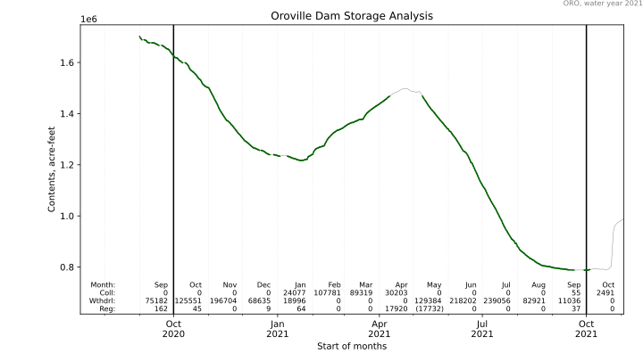

# Mork 30
An implementation of the 30-day storage rule, for California State Water Resources Control Board water right utilization reporting.

## What is the 30-day rule?
This is in Title 23, California Code of Regulations, Section 657.

If you divert water in California under an approriative water right, you're
among many folks who need to file reports each year.
Reports to the State Water Resources Control Board, Division of Water Rights,
using the CalWATRS system.

If your water right includes storage, such as in a tank or reservoir, and
you draw down and refill it more than just once each diversion season, you may need
to follow the 30-day rule.

## Explanation
Please see the [DOCS](DOCS.md) file for instructions and additional details.
The plot below is an example rendering of the calculation.

## Who This Is For
Holders, or owners, of water rights with storage in the State of California may find this useful.
Storage usually means a surface water lake formed by a dam, or a concrete or steel tank,
and water rights are permitted and licensed by the State Water Resources Control Board,
Division of Water Rights.

The authors are not affiliated with the California State Water Resources Control Board in any manner
and nobody from the Water Board has reviewed this algorithm. You are invited to modify this
algorithm for your own purposes, as long as you respect the GNU Public License provisions.
Please suggest corrections and enhancements so that all California diverters can benefit from
a consistent computational approach to applying the 30-day rule.

When all diverters, engineers, attorneys, and regulators are on the same page and following the same calculations, our work is easier, more pleasant,
and we can avoid arithmetical errors.

## Installing and Using
Simply download the source files. Unpack them into a folder or directory of your choosing.
You will need to install dependent Python libraries using `pip`. The dependencies are in [requirements.txt](requirements.txt)
Invoke the script from a terminal window in that folder. Examples are in [DOCS](DOCS.md) and in `examples.sh`.

__Important disclaimer:__ Water right owners are responsible for accurately measuring and reporting water they
store then beneficially use.
The authors of this software hope water right owners will find it useful and helpful
but water right owners are solely responsible for their calculations and reporting.
The authors of Mork30 have possibly misinterpreted the regulations and users of this software must recognize
the authors are not attorneys.
In particular, you will need to modify the program to operate against your own water database;
CDEC specifically disclaims responsibility for the accuracy of the data they publish.
You should also verify how the program interprets the term "30" days.

*Always* consult a water right attorney and a civil engineer experienced with water rights and licensed in California and follow their advice. They are on your side, but only if you engage them.

## Licensing
This software is licensed under the  GNU GENERAL PUBLIC LICENSE Version 3, 29 June 2007, a copy of which is found in the LICENSE file.